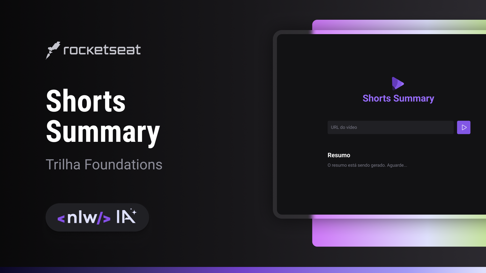

<h1 align="center"> AI-Summary </h1>

Un programa echo para transcribir videos "shorts" del youtube 

  <a href="#-tecnologias">Tecnologias</a>&nbsp;&nbsp;&nbsp;|&nbsp;&nbsp;&nbsp;
  <a href="#-projeto">Projeto</a>&nbsp;&nbsp;&nbsp;|&nbsp;&nbsp;&nbsp;
  <a href="#-layout">Layout</a>&nbsp;&nbsp;&nbsp;|&nbsp;&nbsp;&nbsp;
  <a href="#memo-licença">Licença</a>

 

  

## 🚀 Tecnologias
Ese proyecto fue desarrollado con las seguientes tecnologias:
- HTML y CSS
- Node.js
- NPM
- Git e Github
- Figma
- Phosphor Icons
- Bibliotecas de IA: Xenova/transformers, fluent-ffmpeg, ffmpeg-static y node-wav.
